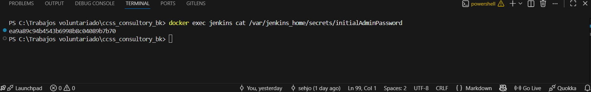
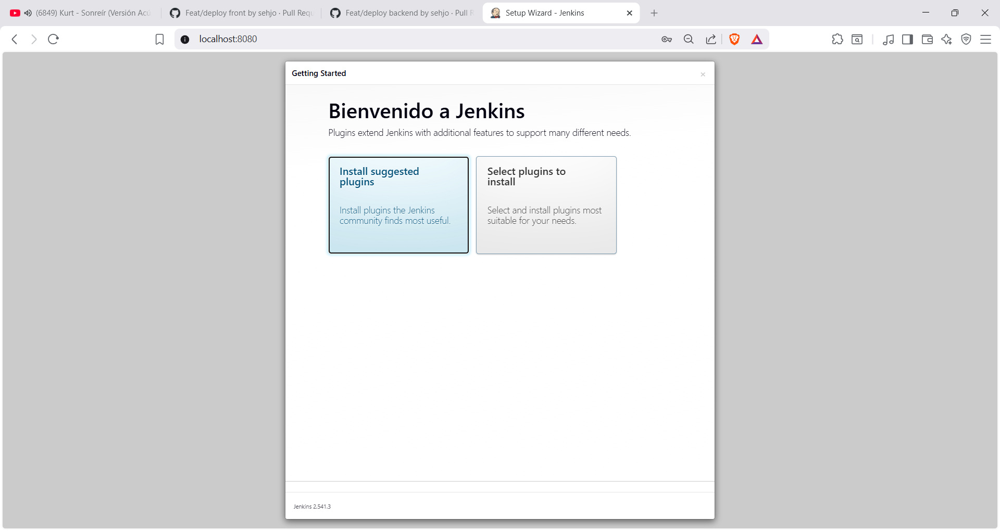
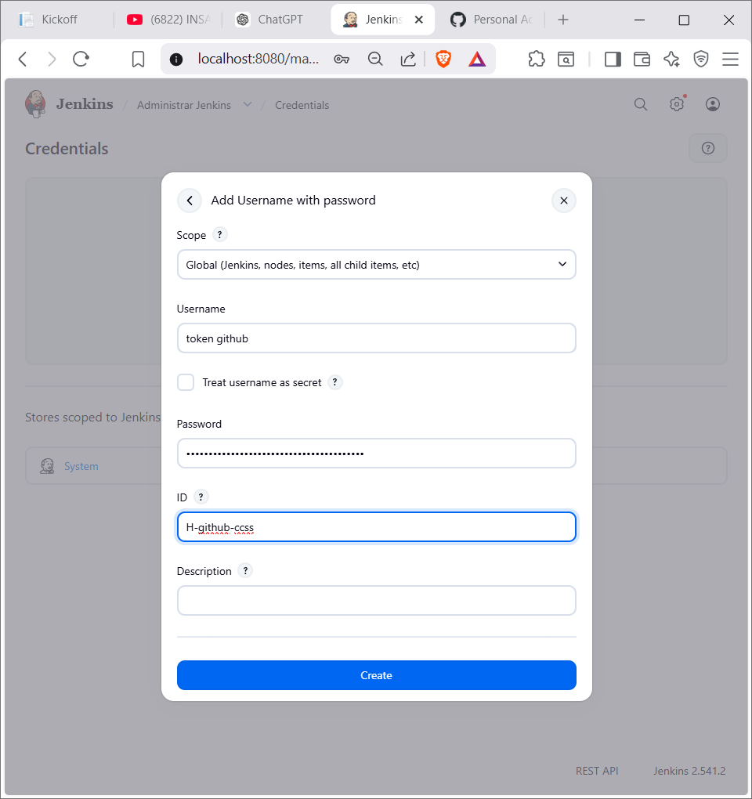
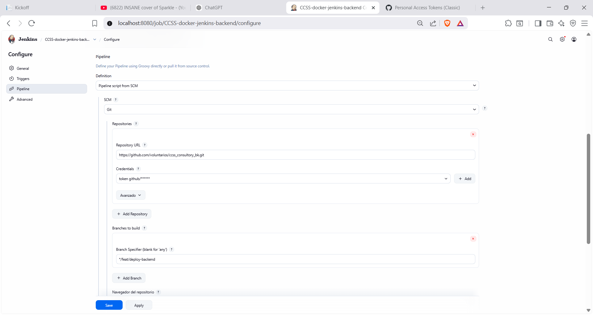
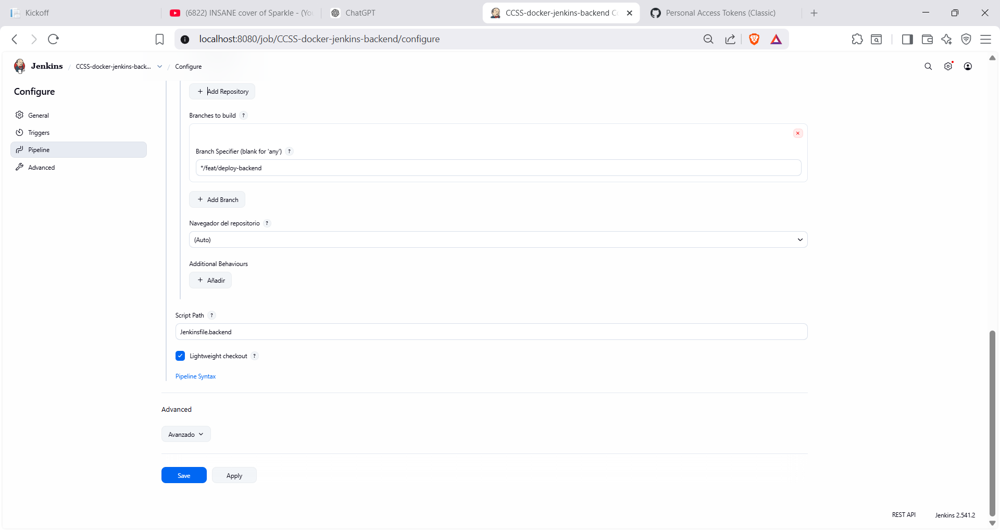

# Guía de Deploy Backend — Jenkins + Docker (paso a paso)

**Proyecto:** CCSS Consultory Backend (Laravel 12 / PHP 8.4)
**Fecha:** 2026-03-16
**Repositorio:** https://github.com/voluntarios/ccss_consultory_bk.git
**Rama:** `feat/deploy-backend`

Esta guía describe exactamente cómo se reproduce el entorno de CI/CD del backend
desde cero en cualquier máquina con Windows + Docker Desktop.

---

## Paso 1 — Verificar prerequisitos

Antes de empezar, comprobar que todo lo necesario está instalado y funcionando.

```powershell
node -v
# Esperado: v18 o superior
# Si falta: https://nodejs.org

npm -v
# Esperado: 9 o superior

wsl --status
# Esperado: WSL instalado (Default Version: 2)
# Si falta: wsl --install

wsl -l -v
# Muestra las distribuciones instaladas y su versión WSL
# Esperado: al menos una distro en STATE Running con VERSION 2

docker --version
# Esperado: Docker version 24 o superior
# Si falta: https://www.docker.com/products/docker-desktop

docker compose version
# Esperado: Docker Compose version v2.x
# Viene incluido con Docker Desktop

docker ps
# Si responde sin error, Docker está corriendo
# Si lanza "Cannot connect to the Docker daemon": abrir Docker Desktop primero
```

> **Nota:** Node y NPM son necesarios solo si el frontend también se despliega en
> esta máquina. Para el backend solo son estrictamente necesarios Docker y WSL2.

---

## Paso 2 — Crear volumen e instalar Jenkins en Docker

Jenkins se corre como contenedor Docker. El volumen `jenkins_home` guarda toda
la configuración y los jobs entre reinicios.

> **Importante:** Montar `docker.sock` no es suficiente. El contenedor de Jenkins
> tambien necesita tener instalado el comando `docker` (Docker CLI).

```powershell
# Crear volumen persistente (solo se hace una vez)
docker volume create jenkins_home

# Construir imagen de Jenkins con Docker CLI
@'
FROM jenkins/jenkins:lts
USER root
COPY --from=docker:27-cli /usr/local/bin/docker /usr/local/bin/docker
RUN chmod +x /usr/local/bin/docker
USER jenkins
'@ | Set-Content -Path .\Dockerfile.jenkins

docker build -t ccss-jenkins-docker:lts -f .\Dockerfile.jenkins .

# Correr Jenkins (Nota: en Windows se requiere --user root para permisos en docker.sock)
docker run -d `
  --name jenkins `
  --restart unless-stopped `
  --user root `
  -p 8080:8080 `
  -p 50000:50000 `
  -v jenkins_home:/var/jenkins_home `
  -v /var/run/docker.sock:/var/run/docker.sock `
  ccss-jenkins-docker:lts

# Verificar que Jenkins si tiene Docker CLI
docker exec jenkins docker --version
```

> **Nota:** El flag `-v /var/run/docker.sock:/var/run/docker.sock` es fundamental.
> Sin él, Jenkins no puede ejecutar comandos `docker` dentro del pipeline.
> En Docker Desktop con WSL2, este socket está disponible automáticamente.

Esperar unos 30s a que Jenkins arranque, luego abrir: http://localhost:8080

```powershell
# Obtener contraseña inicial de administrador
docker exec jenkins cat /var/jenkins_home/secrets/initialAdminPassword
```


> Copiar esa contraseña, pegarla en el formulario de setup de Jenkins
> seleccionar **"Install suggested plugins"**. Esperar instalación.



> Crear usuario administrador con los datos que prefieras.

## Paso 3 — Instalar Git como herramienta en Jenkins

Jenkins necesita Git para hacer checkout del repositorio.

1. Ir a: **Jenkins → Administrar Jenkins → Tools**
2. En la sección **Git installations** → verificar que exista una entrada con Name `Default`
3. Si no existe: agregar con Name `Default` y `git` como ejecutable (lo toma del PATH del contenedor)
4. **Save**

> **Nota:** La imagen `jenkins/jenkins:lts` ya trae Git incluido.
> Este paso es solo para confirmar la configuración.

---

## Paso 4 — Agregar credenciales de GitHub en Jenkins

El pipeline hace checkout de un repositorio privado. Se necesita un token de GitHub.

1. Ir a: **Jenkins → Administrar Jenkins → Credentials → System → Global credentials → Add Credentials**
2. Completar así:

```
Kind: Username with password
Scope: Global
Username: (tu usuario de GitHub)
Password: (tu GitHub Personal Access Token)
ID: H-github-ccss
Description: token para el github
```



> **Cómo generar el token en GitHub:**
> GitHub → Settings → Developer settings → Personal access tokens → Tokens (classic)
> → Generate new token → marcar scope `repo` → Generate → copiar.
>
> **Importante:** El token se muestra solo una vez. Guardarlo antes de cerrar.
> El ID `H-github-ccss` debe coincidir exactamente con el valor en `Jenkinsfile.backend`.

---

## Paso 4.1 — Agregar credenciales de base de datos en Jenkins

El `Jenkinsfile.backend` usa `credentials()` de Jenkins para las contraseñas de MySQL.
Los valores **nunca se guardan en el repositorio** — viven solo en Jenkins.

Crear **dos** credenciales del tipo **Secret text** (mismo menú que el paso anterior):

**Credencial 1 — contraseña del usuario MySQL:**
```
Kind: Secret text
Scope: Global
Secret: ccss_pass_123
ID: ccss-db-password
Description: Contraseña usuario MySQL del backend
```

**Credencial 2 — contraseña root de MySQL:**
```
Kind: Secret text
Scope: Global
Secret: root_ccss_123
ID: ccss-db-root-password
Description: Contraseña root MySQL (health check)
```

> Los IDs `ccss-db-password` y `ccss-db-root-password` deben coincidir
> exactamente con los declarados en el bloque `environment` del `Jenkinsfile.backend`.

---

## Paso 4.2 — Agregar credenciales de correo (Gmail SMTP) en Jenkins

Sin este paso, la función de **recuperación de contraseña** no envía emails en Docker.
El contenedor recibe la config SMTP en tiempo de ejecución desde Jenkins.

Crear **dos** credenciales del tipo **Secret text**:

**Credencial 1 — cuenta Gmail:**
```
Kind: Secret text
Scope: Global
Secret: practicarecuperacion.ccss@gmail.com
ID: ccss-mail-username
Description: Cuenta Gmail para envío de correos
```

**Credencial 2 — App Password de Gmail:**
```
Kind: Secret text
Scope: Global
Secret: pikdetumozzkbumr
ID: ccss-mail-password
Description: App Password Gmail para SMTP
```

> **Cómo obtener el App Password:** Google Account → Security → 2-Step Verification
> → App passwords → crear nuevo → copiar los 16 caracteres.
> El App Password es distinto a la contraseña normal de Gmail.

---

## Paso 5 — Crear el job de Jenkins para el backend

1. Ir a: **Jenkins → New Item**
2. Nombre: `CCSS-docker-jenkins-backend`
3. Tipo: **Pipeline**
4. OK

Dentro de la configuración del job:

**Sección Pipeline:**
- Definition: `Pipeline script from SCM`
- SCM: `Git`
- Repository URL: `https://github.com/voluntarios/ccss_consultory_bk.git`
- Credentials: seleccionar `H-github-ccss`
- Branch Specifier: `*/QA`
- Script Path: `Jenkinsfile.backend`




5. **Save**

## Paso 6 — Preparar Docker para el backend (antes del primer Build)

Este paso va justo despues de crear el job. Aqui se valida que Jenkins pueda
escribir en su volumen y que Docker tenga listas las imagenes base.

Limpiar cache de git y workspace del job:
  ```powershell
  docker exec -u 0 jenkins sh -c "rm -rf /var/jenkins_home/caches/git-*"
  docker exec -u 0 jenkins sh -c "rm -rf /var/jenkins_home/workspace/CCSS-docker-jenkins-backend*"
  docker restart jenkins
  ```

- refresque la pagina  
- ejecutar **Build Now**.

## para verificaar si funciona ingrese el siguiente url:
http://localhost:8000/up
